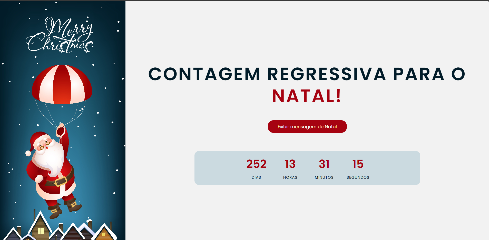

# Contagem Regressiva para o Natal 🎅

Um simples projeto web que exibe uma contagem regressiva em tempo real para o dia 25 de Dezembro (Natal).

## ✨ Funcionalidades

*   Exibe a contagem regressiva mostrando Dias, Horas, Minutos e Segundos restantes para o Natal.
*   Atualiza a contagem a cada segundo.
*   Inclui uma ilustração temática de Natal.
*   Possui um botão para exibir uma mensagem natalina especial (a lógica está no `script.js`).
*   Design simples e direto ao ponto.
*   Uso de Google Fonts (Poppins) para uma melhor tipografia.
*   Estrutura HTML semântica básica com considerações de acessibilidade (H1 oculto).

## 🚀 Tecnologias Utilizadas

*   **HTML5:** Estrutura da página.
*   **CSS3:** Estilização (incluindo `reset.css` para normalização e `style.css` para estilos customizados).
*   **JavaScript (Vanilla):** Lógica da contagem regressiva e exibição da mensagem.
*   **Google Fonts:** Fonte Poppins.
